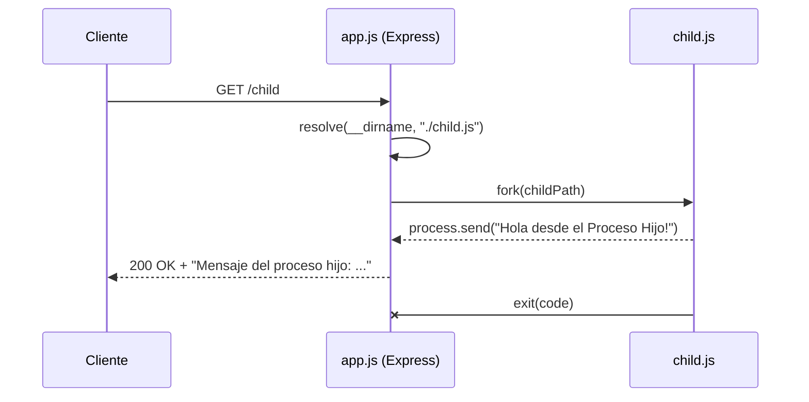

# BE3_77325 - Backend 3 (Node.js)

Aplicación backend educativa construida con Node.js, Express, `dotenv`, `commander` y `child_process.fork()`.

## Objetivo del proyecto

Demostrar, en una app pequeña pero funcional, cómo integrar:

- Configuración por entorno (`.env.<env>`)
- Argumentos de línea de comandos (`--env`)
- API HTTP con Express
- Uso de procesos hijo en Node.js

## Stack

- Node.js (ESM: `"type": "module"`)
- Express `5.2.1`
- dotenv `17.3.1`
- commander `14.0.3`
- nodemon (desarrollo)

## Estructura del proyecto

```text
be3_77325/
├─ app.js                    # Punto de entrada de la API
├─ child.js                  # Script ejecutado como proceso hijo
├─ argumentos.js             # Ejemplo didáctico de process.argv
├─ .env.dev                  # Configuración dev (PORT, SECRET)
├─ .env.local                # Configuración local (PORT, SECRET)
├─ .env.prod                 # Configuración prod (PORT)
├─ .env.qa                   # Configuración QA (PORT)
├─ .env                      # Archivo extra (no usado por app.js directamente)
├─ ejercicios/
│  └─ ejercicios.md          # Guía práctica de ejercicios
├─ teoria/
│  └─ teoria.clase01.md      # Explicación teórica extendida
├─ package.json
└─ README.md
```

## Arquitectura de la aplicación

### 1) Inicialización y configuración

`app.js`:

1. Parsea CLI con `commander` (`--env`, default: `dev`).
2. Valida que el entorno esté en: `local | dev | prod | qa`.
3. Construye el archivo a cargar: `.env.<env>`.
4. Verifica existencia del archivo con `fs.existsSync`.
5. Carga variables con `dotenv.config({ path })`.
6. Resuelve `PORT` (`Number(process.env.PORT)`, fallback `3000`).
7. Resuelve `SECRET` (`process.env.SECRET`, fallback `"Secreto"`).

### 2) Capa HTTP (Express)

Rutas expuestas:

- `GET /` -> health simple (`"Hola desde Node.!"`)
- `GET /secreto` -> devuelve el secreto activo del entorno
- `GET /child` -> crea proceso hijo y responde con su mensaje

### 3) Capa de procesos

- `fork()` ejecuta `child.js` en otro proceso Node.
- El hijo envía datos al padre por IPC con `process.send(...)`.
- El padre escucha `message`, `error` y `exit`.

## Flujo de `GET /child` (Mermaid)



## Cómo funciona la app actualmente

### Comportamiento real del arranque

- El script `npm run dev` ejecuta: `nodemon app.js --env local`
  - Carga `.env.local` (actualmente `PORT=8001`, `SECRET=...`)
- El script `npm start` ejecuta: `node app.js --env prod`
  - Carga `.env.prod` (actualmente `PORT=80`)

### Notas de funcionamiento actual

- Si `--env` no es válido, la app termina con error.
- Si no existe `.env.<env>`, la app termina con error.
- Si `PORT` no es numérico, hoy se loguea error, pero el proceso no hace `exit`.
- El archivo `.env` base existe, pero `app.js` usa explícitamente `.env.<env>`.
- `/secreto` muestra `SECRET` (no `SECRETO`); si falta, usa `"Secreto"`.

## Ejecución local

### Requisitos

- Node.js 18+ recomendado
- npm

### Instalar dependencias

```bash
npm install
```

### Modo desarrollo

```bash
npm run dev
```

### Modo producción

```bash
npm start
```

### Ejecutar con entorno manual

```bash
node app.js --env local
node app.js --env dev
node app.js --env qa
node app.js --env prod
```

## API actual

### `GET /`

Respuesta:

```text
Hola desde Node.!
```

### `GET /secreto`

Respuesta:

```text
Mi Secreto es: "<valor de SECRET>"
```

### `GET /child`

Respuesta:

```text
Mensaje del proceso hijo: "Hola desde el Proceso Hijo!"
```

## Scripts disponibles

```json
{
  "start": "node app.js --env prod",
  "dev": "nodemon app.js --env local",
  "test": "echo \"Error: no test specified\" && exit 1"
}
```

## Material de apoyo incluido

- `teoria/teoria.clase01.md`: desarrollo teórico detallado.
- `ejercicios/ejercicios.md`: prácticas guiadas por tema.

## Licencia

MIT
