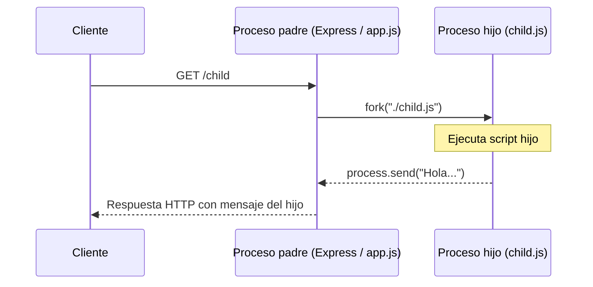

# Teoria para alumnos - Proyecto `be3_74605`

## 1. Para que sirve este proyecto

Este proyecto esta pensado para que ustedes practiquen varios conceptos importantes de Node.js dentro de una aplicacion real (simple, pero completa).

Van a ver como se combinan estos temas:

1. `process` (informacion del proceso que ejecuta Node)
2. Variables de entorno con `dotenv`
3. Argumentos por consola con `commander`
4. Servidor web con `express`
5. Procesos hijo con `child_process.fork()`

La idea no es memorizar todo de una vez, sino entender **que problema resuelve cada parte**.

---

## 2. Que archivos tiene el proyecto y para que sirve cada uno

### `app.js` (archivo principal)

Este es el archivo mas importante del proyecto.

Hace varias cosas:

- lee argumentos de consola (`--env`)
- decide que archivo `.env` cargar
- levanta un servidor Express
- define endpoints (`/`, `/secreto`, `/child`)
- ejecuta un proceso hijo cuando llaman a `/child`

### `argumentos.js`

Es un ejemplo minimo para entender `process.argv`.

Sirve para ver claramente que recibe Node cuando ejecutan un script desde la terminal.

### `child.js`

Es el script que se ejecuta como proceso hijo desde `app.js`.

Su trabajo es enviar un mensaje al proceso principal (padre).

### `.env.dev` y `.env.prod`

Son archivos de configuracion por entorno.

Por ejemplo:

- `PORT`
- `SECRETO`

Esto permite ejecutar la misma app con diferentes configuraciones sin modificar el codigo.

### `.env`

Es otro archivo de variables (en este proyecto no es el que usa `app.js`).

Aparece para mostrar una variable sensible como `JWT_SECRET`.

### `ejercicios/ejercicios.md`

Es una guia de ejercicios para practicar.

Tomalo como un mapa de temas para estudiar.

---

## 3. Concepto base: `process` en Node.js

`process` es un objeto global que representa el proceso actual de Node.

No hace falta importarlo. Node lo da automaticamente.

### Cosas utiles que pueden leer desde `process`

- `process.argv`: argumentos enviados por consola
- `process.cwd()`: carpeta actual desde donde ejecutaron el comando
- `process.pid`: ID del proceso
- `process.platform`: sistema operativo
- `process.version`: version de Node
- `process.env`: variables de entorno

### Ejemplo con `argumentos.js`

Si ustedes ejecutan:

```bash
node argumentos.js hola 123
```

Node arma un array `process.argv` con datos como:

1. Ruta del ejecutable de Node
2. Ruta del archivo `argumentos.js`
3. `"hola"`
4. `"123"`

Lo importante es que entiendan esto:

- `argv[0]` y `argv[1]` los agrega Node
- desde `argv[2]` empiezan los argumentos que escribieron ustedes

---

## 4. Variables de entorno: que son y por que se usan

### Que es una variable de entorno

Es un dato de configuracion que vive fuera del codigo.

Ejemplos comunes:

- puerto del servidor
- secretos / claves
- modo de ejecucion (`dev`, `prod`)
- URL de una base de datos

### Por que esto es importante

Porque evita escribir datos sensibles dentro del codigo fuente.

Tambien permite usar el mismo codigo en distintos entornos:

- desarrollo
- testing
- produccion

### Que hace `dotenv`

Lee un archivo `.env` y carga sus valores dentro de `process.env`.

Ejemplo conceptual:

```js
dotenv.config({ path: ".env.dev" });
console.log(process.env.PORT);
```

### Que hace este proyecto

No carga siempre el mismo `.env`.

Segun el argumento `--env`, carga:

- `.env.dev`
- `.env.prod`

Eso les muestra una idea muy usada en backend real: **configuracion por entorno**.

### Qué hace exactamente `dotenv.config({ path: envFilePath })`

Esta línea significa:

```js
dotenv.config({ path: envFilePath });
```

"Leé el archivo `.env` indicado en `path` y cargá sus variables dentro de `process.env`".

#### Ejemplo

Si `envFilePath` vale:

```txt
.env.dev
```

y ese archivo tiene:

```env
PORT=5000
SECRETO=Este es un SECRETO
```

entonces después de `dotenv.config(...)` van a tener:

- `process.env.PORT = "5000"`
- `process.env.SECRETO = "Este es un SECRETO"`

#### Importante (detalle que suele confundir)

Las variables de `process.env` llegan como **texto (string)**.

Aunque parezcan números:

- `PORT=5000` -> `process.env.PORT` será `"5000"` (string)

#### Antes y después (idea mental)

- Antes de `dotenv.config(...)`: `process.env.PORT` puede ser `undefined`
- Después de `dotenv.config(...)`: `process.env.PORT` tiene el valor leído del archivo

#### Muy importante

`dotenv` **no crea variables permanentes en la PC**.

Solo carga esas variables para **el proceso Node actual** (mientras el programa está corriendo).

---

## 5. Argumentos por consola con `commander`

### Por que no alcanza con `process.argv` siempre

Se puede leer todo con `process.argv`, pero cuando el programa crece empieza a ser incomodo:

- hay que buscar indices del array
- es facil confundirse
- cuesta validar opciones

### Que ventaja tiene `commander`

`commander` permite definir opciones de forma mas clara.

En este proyecto se usa:

```txt
-e, --env <enviroment>
```

Entonces ustedes pueden ejecutar:

```bash
node app.js --env dev
node app.js --env prod
```

Y luego el codigo obtiene ese valor con:

```js
const options = program.opts();
const envName = options.env || "dev";
```

Si no mandan `--env`, se usa `"dev"` como valor por defecto.

### Desarmando esta parte de `app.js` (paso a paso)

```js
const program = new Command();
program.option("-e, --env <enviroment>", "Entorno de ejecucion");
program.parse();

const options = program.opts();
const envName = options.env || "dev";
const envFilePath = `.env.${envName}`;
```

#### 1. `program.option(...)`

Le dice a `commander` que el programa acepta una opción:

- `-e` (forma corta)
- `--env` (forma larga)

Ejemplo de uso:

```bash
node app.js --env dev
node app.js --env prod
```

#### 2. `program.parse()`

Hace que `commander` lea lo que ustedes escribieron en la terminal.

#### 3. `program.opts()`

Devuelve un objeto con las opciones parseadas.

Por ejemplo, si ejecutan:

```bash
node app.js --env dev
```

entonces:

```js
options.env === "dev"
```

#### 4. `const envName = options.env || "dev"`

Si ustedes pasaron `--env`, usa ese valor.

Si no pasaron nada, usa `"dev"` como valor por defecto.

Ejemplos:

- `node app.js --env prod` -> `envName = "prod"`
- `node app.js` -> `envName = "dev"`

#### 5. `const envFilePath = \`.env.${envName}\``

Esta línea **no crea el archivo**.

Solo arma un texto (string) con el nombre del archivo a buscar.

Ejemplos:

- `envName = "dev"` -> `envFilePath = ".env.dev"`
- `envName = "prod"` -> `envFilePath = ".env.prod"`
- `envName = "qa"` -> `envFilePath = ".env.qa"`

Después el código verifica si ese archivo existe:

```js
if (!fs.existsSync(envFilePath)) {
  console.error(`El archivo ${envFilePath} no existe!`);
  process.exit(1);
}
```

Si no existe, muestra error y corta la ejecución.

### Mejora recomendada: validar entornos con `includes(...)`

En vez de escribir un `if` largo con muchos `&&`, una forma más clara es definir un array con entornos permitidos.

```js
const allowedEnvs = ["local", "dev", "qa", "prod"];

if (!allowedEnvs.includes(envName)) {
  console.error(`Entorno invalido: "${envName}"`);
  console.error(`Usa uno de estos valores: ${allowedEnvs.join(" | ")}`);
  process.exit(1);
}
```

#### ¿Por qué esta versión está buena para aprender?

- se lee mejor
- es más fácil de mantener
- si agregan otro entorno, solo lo suman al array
- evita errores al escribir condiciones largas

#### Ojo (detalle importante)

Que el entorno sea "válido" en ese `if` no significa que el archivo exista.

Por ejemplo:

- `qa` puede estar permitido
- pero si no existe `.env.qa`, igual fallará después con `fs.existsSync(...)`

---

## 6. Express: el servidor web del proyecto

`express` es una libreria para crear servidores HTTP en Node.js.

Con Express ustedes pueden crear endpoints rapidamente.

### Flujo basico que van a ver en `app.js`

1. Crear la app:

```js
const app = express();
```

1. Agregar middleware:

```js
app.use(express.json());
```

1. Crear rutas:

```js
app.get("/", ...);
app.get("/secreto", ...);
app.get("/child", ...);
```

1. Levantar el servidor:

```js
app.listen(PORT, ...);
```

### Que hace cada endpoint de este proyecto

#### `GET /`

Responde un texto simple.

Sirve para comprobar que el servidor esta funcionando.

#### `GET /secreto`

Responde el valor de `SECRETO` cargado desde `.env`.

En clase sirve para comprobar que `dotenv` realmente cargo el archivo correcto.

#### `GET /child`

Crea un proceso hijo y devuelve el mensaje que manda ese hijo.

Este endpoint combina Express + `child_process`.

---

## 7. ES Modules y por que aparece `__dirname` "raro"

En `package.json` este proyecto tiene:

```json
"type": "module"
```

Eso significa que usa ES Modules (`import`) en lugar de CommonJS (`require`).

### Importante

En ES Modules, `__dirname` y `__filename` **no existen automaticamente**.

Por eso en `app.js` se reconstruyen asi:

```js
const __filename = fileURLToPath(import.meta.url);
const __dirname = dirname(__filename);
```

Esto se hace para poder armar rutas a archivos locales, por ejemplo:

- `./child.js`

Si esta parte les resulta rara, esta bien: es una duda super comun cuando se empieza con ESM en Node.

---

## 8. Procesos hijo con `child_process.fork()`

### Antes de ver el código: ¿para qué sirve esto en la vida real?

Los procesos hijos se usan cuando necesitan **sacar trabajo pesado o aislable** del proceso principal de Node para que el servidor siga respondiendo rápido y estable.

Pensalo así:

- Proceso principal: atiende requests HTTP
- Proceso hijo: hace trabajo pesado / separado

Esto ayuda por tres motivos muy importantes:

#### 1. Evitar bloquear el event loop

Node ejecuta JavaScript en un solo hilo (event loop).

Si el servidor se pone a hacer un cálculo pesado, puede quedar "tildado" por un rato y responder lento.

Con un proceso hijo, ese trabajo se hace aparte y el servidor principal sigue atendiendo requests.

Ejemplos típicos:

- generar reportes
- procesar archivos grandes
- transformar CSVs
- tareas de cálculo intensivo

#### 2. Aislar tareas riesgosas

Si una tarea falla, consume mucha memoria o se cuelga:

- puede fallar el hijo
- pero no necesariamente cae todo el servidor principal

Esto mejora la estabilidad (resiliencia).

#### 3. Separar responsabilidades (modelo API + worker)

Es una idea muy usada en backend real:

- padre (API): recibe request, valida datos, responde HTTP
- hijo (worker): procesa la tarea y devuelve resultado

En este proyecto se muestra esa idea en miniatura con:

- `fork()` -> crea otro proceso Node
- `process.send()` / evento `message` -> comunicación entre padre e hijo

### Idea general (en palabras simples)

El servidor principal puede pedirle a otro proceso de Node que haga una tarea.

Ese "otro proceso" se llama **proceso hijo**.

En este proyecto se crea con:

```js
fork(childPath)
```

### Que se busca enseñar con esto

- que Node puede ejecutar otros procesos
- que un proceso padre y uno hijo pueden comunicarse
- que hay eventos como `message`, `error`, `exit`

### Cómo pensarlo usando el endpoint `/child`

Cuando llaman a `/child`, el server principal **no hace el trabajo en el mismo proceso**.

En cambio:

1. crea un hijo con `fork()`
2. espera un mensaje del hijo
3. responde con ese mensaje

La demo actual manda un mensaje simple, pero la idea es la misma que se usaría para una tarea pesada.

### Dibujo mental (padre ↔ hijo)

```txt
Cliente HTTP
    |
    v
GET /child
    |
    v
Proceso padre (app.js / Express)
    |  fork("./child.js")
    |-------------------------------> Proceso hijo (child.js)
    |                                 |
    |   mensaje por IPC (process.send)|
    |<--------------------------------|
    |
    v
Response HTTP al cliente
```

### Diagrama Mermaid (misma idea, versión visual)



### Quién usa qué (esto se confunde mucho)

- **Padre (`app.js`)**
  - crea el hijo con `fork(...)`
  - escucha mensajes con `child.on("message", ...)`
  - puede enviar datos al hijo con `child.send(...)`

- **Hijo (`child.js`)**
  - recibe datos del padre con `process.on("message", ...)`
  - responde al padre con `process.send(...)`

### Analogía rápida (para acordarse)

- Proceso principal = recepcionista (atiende a todos)
- Proceso hijo = backoffice (hace el trabajo pesado)

Si el recepcionista se pone a hacer el trabajo pesado, la fila crece y todo se vuelve lento.

### Que pasa en este proyecto cuando llaman a `/child`

#### En `app.js` (proceso padre)

1. Se obtiene la ruta de `child.js`
2. Se crea el hijo con `fork()`
3. El padre espera un mensaje con `child.on("message", ...)`
4. Cuando llega el mensaje, responde al cliente

Tambien se escuchan:

- `error`: si algo falla
- `exit`: cuando el hijo termina

#### En `child.js` (proceso hijo)

El hijo ejecuta:

```js
process.send("Hola desde el Proceso Hijo");
```

Ese mensaje vuelve al padre y luego se envia como respuesta del endpoint `/child`.

### Detalle importante

`process.send()` existe cuando el archivo fue ejecutado con `fork()`.

### Dos notas importantes (muy comunes en preguntas)

- `fork()` es ideal cuando quieren ejecutar **otro script de Node** y comunicarse por mensajes.
- Para tareas de I/O (HTTP, DB, archivos), muchas veces no hace falta un hijo. El problema suele aparecer más en tareas **CPU-bound** (cálculo pesado) o cuando buscan aislamiento.

### Cuándo NO hace falta un proceso hijo (también suma entender esto)

No usen un hijo "porque sí".

Muchas tareas ya son no bloqueantes en Node y pueden hacerse directo:

- consultas a base de datos
- requests HTTP a APIs
- lectura/escritura de archivos (usando APIs async)

Usar un proceso hijo tiene costo:

- crear el proceso
- comunicar datos entre procesos
- manejar errores y cierre

Por eso se usa cuando realmente aporta (CPU pesado o aislamiento).

### Diferencia rápida: `fork()` vs `spawn()` vs `exec()` (nivel introductorio)

- `fork()`
  - para ejecutar **otro script de Node**
  - incluye canal de mensajes (IPC) fácilmente

- `spawn()`
  - para ejecutar comandos/programas del sistema
  - recibe salida por `stdout` / `stderr`

- `exec()`
  - ejecuta un comando y devuelve la salida completa
  - cómodo para cosas cortas (no ideal para salidas enormes)

En este proyecto usamos `fork()` porque el hijo también es Node (`child.js`).

---

## 9. Por que se valida si existe el archivo `.env`

Antes de cargar variables, `app.js` valida que exista el archivo `.env.<modo>`.

La idea es evitar errores confusos.

Ejemplo:

```bash
node app.js --env algo-que-no-existe
```

En ese caso, el programa:

- muestra un error claro
- corta la ejecucion con `process.exit(1)`

Esto es una buena practica porque falla rapido y con un mensaje entendible.

### Otra línea importante: `const PORT = process.env.PORT || 3000;`

Esta línea significa:

- "Usá `process.env.PORT` si existe"
- "Si no existe, usá `3000`"

```js
const PORT = process.env.PORT || 3000;
```

#### Qué está pasando con `||`

El operador `||` (OR lógico) se usa acá como "plan B".

Si el valor de la izquierda existe (y es usable), lo toma.
Si no, usa el de la derecha.

#### Ejemplos

Si en `.env.dev` tienen:

```env
PORT=5000
```

entonces:

```js
PORT === "5000"
```

Si no existe `PORT`:

```js
PORT === 3000
```

#### Ojo con el tipo de dato (esto es MUY importante)

`process.env.PORT` llega como **string**.

Entonces pueden pasar dos cosas:

- con `.env`: `PORT` queda `"5000"` (string)
- sin `.env`: `PORT` queda `3000` (number)

En `app.listen(PORT)` esto normalmente funciona igual, porque Node/Express lo acepta.

#### ¿Por qué conviene convertir a número?

Para evitar mezclar tipos y ser más claros:

```js
const PORT = Number(process.env.PORT) || 3000;
```

Eso convierte `"5000"` en `5000`.

#### Ojo con esta versión

Es útil para empezar, pero si quieren validar mejor, conviene separar pasos.

#### Versión más clara (cuando quieran ser más estrictos)

```js
const PORT = process.env.PORT ? Number(process.env.PORT) : 3000;
```

Más adelante, cuando vean validaciones, incluso podrían chequear si el valor es realmente un número válido.

### Versión recomendada (como queda en este proyecto)

```js
const rawPort = process.env.PORT;
const PORT = rawPort ? Number(rawPort) : 3000;

if (Number.isNaN(PORT)) {
  console.error(`PORT invalido: "${rawPort}"`);
  process.exit(1);
}
```

#### ¿Qué mejora esta versión?

- mantiene `PORT` como número
- separa lectura, conversión y validación
- da un error claro si el `.env` tiene algo inválido (ej: `PORT=hola`)
- evita que el programa siga con una configuración rota

### Y esta línea también aplica la misma idea

```js
const SECRET = process.env.SECRETO || "Secreto";
```

Significa:

- usar la variable `SECRETO` si vino desde `.env`
- si no existe, usar `"Secreto"` como valor por defecto

#### Nota importante para producción

Para demo/curso está bien usar un valor por defecto.

En producción real, para variables sensibles (secretos, tokens, claves) suele ser mejor:

- validar que existan
- y fallar con error si faltan

porque un fallback inseguro puede ocultar un problema de configuración.

---

## 10. Flujo completo de la app (para que lo entiendan de punta a punta)

Cuando ustedes ejecutan:

```bash
node app.js --env dev
```

pasa esto:

1. Node carga `app.js`
2. Se importan las librerias
3. `commander` lee `--env dev`
4. Se arma el nombre `.env.dev`
5. Se valida que ese archivo exista
6. `dotenv` carga las variables en `process.env`
7. Se crea la app Express
8. Se registran las rutas
9. `app.listen(PORT)` deja el servidor esperando requests

Y cuando hacen `GET /child`:

1. Entra a la ruta `/child`
2. Se crea el proceso hijo con `fork()`
3. `child.js` envia un mensaje
4. El padre recibe el mensaje
5. Express responde al cliente

### Flujo de `/child` explicado con una frase

El endpoint `/child` muestra un patrón muy real:

**la API recibe -> delega trabajo -> espera resultado -> responde**.

---

## 11. Como estudiar este proyecto sin perderse

### Recomendacion de orden (muy importante)

No intenten entender `app.js` todo junto la primera vez.

Mejor hagan esto:

1. Lean `argumentos.js` y prueben `process.argv`
2. Miren `.env.dev` y `.env.prod`
3. Lean `app.js` hasta la ruta `/`
4. Entiendan `/secreto` (dotenv)
5. Entiendan `commander` (`--env`)
6. Recien al final vean `/child` y `child.js`

### Objetivo al leer

No se pregunten solo "que hace".

Preguntense tambien:

- "por que esta linea existe?"
- "que problema evita?"
- "que pasaria si la saco?"

Eso les va a dar mucha mas seguridad al explicar.

---

## 12. Comandos para practicar ustedes

### Ver `process.argv`

```bash
node argumentos.js hola mundo 123
```

### Levantar servidor en desarrollo

```bash
node app.js --env dev
```

### Levantar servidor en produccion

```bash
node app.js --env prod
```

### Endpoints para probar

- `GET http://localhost:5000/` (si usan `dev`)
- `GET http://localhost:5000/secreto`
- `GET http://localhost:5000/child`

> Si usan `prod` y `PORT=80`, puede ser `http://localhost/`.

### Qué deberían ver (para comprobar que entendieron)

- Al ejecutar `node argumentos.js hola mundo 123`
  - deberían ver un array
  - y notar que sus argumentos empiezan desde el índice 2

- Al levantar `node app.js --env dev`
  - debería arrancar en el puerto definido en `.env.dev`

- Al abrir `/secreto`
  - deberían ver el valor de `SECRETO` del entorno cargado

- Al abrir `/child`
  - deberían ver un mensaje que viene de `child.js` (no del proceso principal)

---

## 13. Errores y confusiones comunes (normal si les pasa)

- "No entiendo `__dirname` con `import`"
  - Es normal. En ESM hay que reconstruirlo manualmente.

- "No me levanta en `PORT=80`"
  - Puede requerir permisos de administrador.

- "No aparece `process.send()`"
  - Porque ese script tiene que ejecutarse con `fork()`.

- "Quiero comentar `package.json`"
  - No se puede con comentarios porque JSON no los admite.

- "¿Por qué el endpoint `/child` responde texto y no JSON?"
  - Porque es una demo simple. Podrían devolver JSON sin problema (`res.json(...)`).

- "¿Esto ya es paralelismo real?"
  - Sí, hay procesos separados. Pero la comunicación y coordinación siguen siendo responsabilidad de ustedes.

- "¿`fork()` reemplaza colas (RabbitMQ, etc.)?"
  - No. `fork()` sirve para entender y resolver casos simples/locales. Las colas aparecen cuando el sistema crece.

### Checklist de debugging rápido para `/child`

Si `/child` falla, revisen en este orden:

1. ¿Existe `child.js` en la ruta correcta?
2. ¿Se está usando `fork()` con la ruta correcta?
3. ¿`child.js` ejecuta `process.send(...)`?
4. ¿El padre tiene `child.on("message", ...)`?
5. ¿Hay error en consola (`child.on("error", ...)`)?
6. ¿El hijo termina muy rápido con error (`exit code`)?

### Logs que conviene agregar (cuando algo no se entiende)

- En el padre:
  - `console.log("Creando hijo...", childPath)`
  - `console.log("Mensaje del hijo:", msg)`
  - `console.log("Exit code:", code)`

- En el hijo:
  - `console.log("Hijo iniciado, pid:", process.pid)`
  - `console.log("Enviando mensaje al padre...")`

### Mini speech (60 segundos) para explicar `/child` en clase

> Este endpoint muestra cómo delegar trabajo a un proceso hijo en Node.  
> Cuando hacemos `GET /child`, el servidor principal (Express) crea otro proceso con `fork()` y ejecuta `child.js`.  
> El hijo hace su trabajo y devuelve un mensaje con `process.send(...)`.  
> El padre escucha ese mensaje con `child.on("message", ...)` y recién ahí responde al cliente.  
> Esto sirve para no bloquear el servidor principal cuando la tarea es pesada o cuando queremos aislarla.

---

## 14. Resumen final para ustedes

Si entienden este proyecto, ya estan practicando ideas muy importantes de backend:

- configuracion por entorno
- lectura de argumentos por consola
- creacion de un servidor HTTP
- uso del objeto `process`
- comunicacion entre procesos

No hace falta dominar todo en una sola clase.

La clave es entender cada bloque por separado y despues ver como se integran.

### Siguiente paso recomendado (si ya entendieron esta guía)

1. Implementar el ejercicio de comunicación bidireccional:
   - padre envía un número
   - hijo responde el doble
2. Convertir `/child` para que devuelva JSON
3. Crear `/info` con datos de `process`
4. Agregar `--debug` con `commander`

## 🧑‍🏫 Profesor  

👨‍💻 **Alejandro Daniel Di Stefano**  
📌 **Desarrollador Full Stack**  
🔗 **GitHub:** [Drako01](https://github.com/Drako01)  
